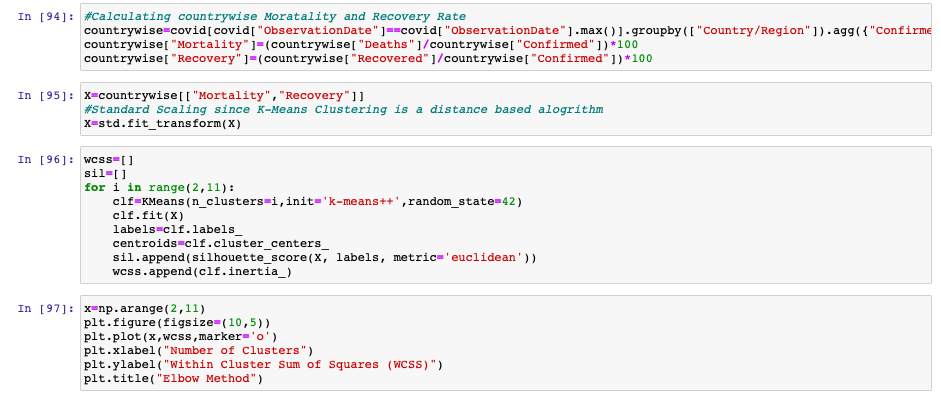
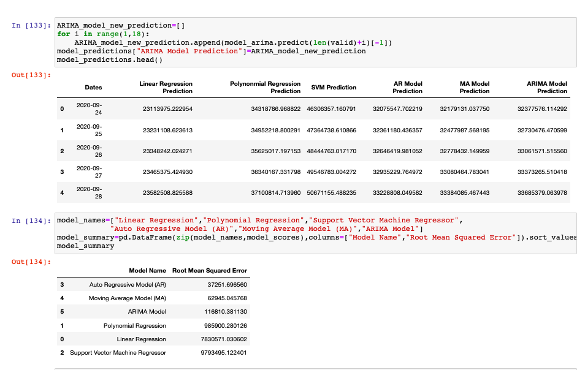

# Covid19-Prediction-Project

## Introduction : 
In terms of infrastructure, finance, industry, manufacturing, and many other tools, our society is in an era of incredible attempts to fight against the spread of this life-threatening disorder. Artificial Intelligence (AI) researchers are reinforcing their ability to develop mathematical paradigms using nationally dispersed data to investigate this pandemic. 

This project aims to apply the machine learning models by using the real-time data from Kaggle Novel Corona Virus 2019 Dataset and Predict the future cases in the U.S.A for understanding the need and necessity of available resources and also to implement required actions accordingly to reduce the growth of coronavirus.
In this pandemic investigation and forecasting, machine learning algorithms play an important role. Machine learning approaches help to identify the patterns of the epidemic. As a result, an immediate response might be prepared to prevent the spread of COVID-19 across society of the virus. In addition, machine learning models are used to predict the spread of COVID-19 across society and identify collective actions by the use of real-time data from Kaggle Novel Corona Virus 2019 Dataset.

Observing the trends of Covid19 spread across the world and predicting the confirmed cases using various machine learning algorithms and determine the best model by looking into the root mean square error.

## Statement of the Problem : 
Understand the trends and predict future cases in the USA using different machine learning algorithms(SVM, K-means, Linear regression, ARIMA) by observing the growth factor and mortality rate. Initially clean the data according to the need and apply the growth rate and mortality rate formula and observe the trends and then using them apply different ml algorithms for predicting the future. 

## Literature Review:
Coronaviruses are a large family of viruses that can cause a human being to become severely ill. The latest outbreak of coronavirus disease was announced in late December 2019. Long-term short-term memory (LSTM) model training is highly dependent on the variance in the values, with the fact that the greater the deviation, the more time it takes to practice. The number of cases was scaled to suit the LSTM model using min max scaler and the projected cases were later rescaled to the original range using invert minmax transform from "sklearn" python library.
The findings show that a minimum root mean square error was generated by polynomial regression (PR)
 
The Global Data Science Project (GDSP) for COVID-19 is an international team that works on different facets of society, including mobility, health, economics, education and online activity. 
COVID-19 has had a major influence on our communities through the direct and indirect consequences of policy interventions to tackle the spread of viruses. 
The number of international flights fell overall to about 88 percent in March due to travel restrictions. In particular, the number of flights connecting Europe decreased sharply in mid-March after the United States announced travel restrictions to Europe and the EU and participating countries decided to close borders, a decrease of 84 percent compared to 10 March. 
By analyzing posts on social networking sites such as Twitter, we established the increased concern for mental health. The number of posts with #depression on Instagram doubled in early April 2020, which may reflect the increase in awareness of mental health among Instagram users.
 
## Objectives of the Study:
To determine the future confirmed and death cases we can easily estimate the workload on the health care department and then accordingly they can plan and adjust the resources or even find more ways to get the resources for example in the upcoming days there is going to be more number of confirmed cases so the need for ventilators or other supplies to cure things can be adjusted. Having an estimate would help a lot. If the confirmed case rate is going to decrease then the researchers could focus more on finding a vaccine for the virus. 
 
## Data Collection:
[Novel-corona-virus-2019-dataset](https://www.kaggle.com/sudalairajkumar/novel-corona-virus-2019-dataset)-
This data set contains columns like ObservationDate-date format from 01/22/2020-09/23/2020, Province/State, Country/Region, Last Updated, Confirmed, Deaths, recovered. 
## Exploratory data analysis (EDA) and Hypotheses for the Study:
Initially imported the data and observed the data to make necessary transformations for analysis like converting the observation date column format to DateTime format(yyyy-mm-dd) and dropped the column S.No which is of no use.
## Initial Data: 
The data contains days confirmed cases which are updated at few timings on the same day separated by region. For our analysis, we have to group the data country wise and day wise and use aggregate functions like sum, log to get the total number of cases in that country on a particular day.

## Data Transformation:
Dropped column S.No which is not required for our analysis and converted the Observation Date to required Date-time Format(YYYY-MM-DD)

Grouping the countries and perform aggregate functions to get the sum of confirmed cases in a region on a particular date observe the total number of confirmed,recoverd,death,Active cases and also log(Active), Log(Confirmed cases)
Active Cases = Number of Confirmed Cases - Number of Recovered Cases - Number of Death Cases

Grouped the data according to daywise along with the new column Day since 

### Basic Information:
Observing the basic informaton 

### choropleth plot:
Observing the Corona virus spread across the world using choropleth plot This is an animation plot that shows how the covid initially started and how it spread to the entire world by changing the color of the covid affected region day by day.

I suggest you to look into this observation using python code for better undestanding

### Distribution of Active and Closed cases:
#### Active Cases:

Active Cases = Number of Confirmed Cases - Number of Recovered Cases - Number of Death Cases
By observing the trend we can observe that it is an increasing plot and the increase in Active cases indicate that the death and recovered cases are lower than the confirmed cases per day.
#### Closed Cases:

Closed Cases = Number of Recovered Cases + Number of Death Cases
An increase in Closed cases indicates that, Either more people are getting recovered or more people are dying. 
### Mortality Rate and Recovery Rate:

Mortality rate = (Number of Death Cases / Number of Confirmed Cases) x 100
Recovery Rate= (Number of Recovered Cases / Number of Confirmed Cases) x 100

From the recovery rate graph, we can observe that it started raising again which is evidence that the number of closed cases is increasing. 
The mortality rate is normal which is a good sign.
### Analysis of United Sates Data:

Observing its trends and comparing with the most affected countries and also neighboring countries of the united states
### Clustring countries:

Clustering the countries by using countrywide mortality and recovery rate, Here I used Elbow 
method to determine the number of clusters.

To determine the number of clusters we used Elbow Method and Hierarchical Clustering Both of them shows K=3 will correct number of clusters.

From the above graph we can easily understand that Cluster 0 countries are countries with High recovery rate and low mortality rate, Cluster 1 are countries with Average recovery rate and high mortality rate, Cluster 2 are High Mortality and low recovery rate which means they really have to take extreme measure to reduce the mortality rate and increase the recovery rate.
## Machine Learning Models For Confirm Cases Prediction:
### Linear Regression:

Model Graph for Linear Regression

From the above graph we can easily see that the Linear regression model is falling apart. The trend of the graph is not linear which is clearly visible.
### Polynomial Regression:

Model Graph for Polynomial Regression

It looks similar with the Polynomial regression model but tends to be deviated for the recent times.
### SVM:

Model Graph for SVM 

The SVM model does not fit properly, It clearly shows a deviation and intersecs the actual one at two points.
### Auto Regression(AR):

Confirmed cases AR model

### Moving Average(MA):

Confirmed cases MA model

### ARIMA:

Confirmed cases ARIMA model

## Results:

Prediction for next 5 days using all the 6 models and also root mean square error value of all the models sorted in ascending order are published above. From the above results we can observe that the error value is observed to be less for the AR model. Usually time series models are best for such a type of date.
## Conclusion:
Our Predictions Show that the Auto-Regressive Model is the best among the 6 models with the 
less root mean square value of 37251.69. Since this is time-series data ARIMA will be the best 
model for handling the time series data.
## Bibliography:
#### 1) [Novel Corona Virus 2019 Dataset](https://www.kaggle.com/sudalairajkumar/novel-corona-virus-2019-dataset)
#### 2) [Coronavirus: Tesla donates hundreds of ventilators to New York](https://www.bbc.com/news/technology-52071314)
#### 3) [COVID-19 Epidemic Analysis using Machine Learning and Deep Learning Algorithms](https://www.medrxiv.org/content/10.1101/2020.04.08.20057679v2.full.pdf)
#### 4) [COVID-19 Outbreak Prediction using Machine Learning Algorithm | by Wie Kiang H. | Jul, 2020](https://towardsdatascience.com/covid-19-outbreak-prediction-using-machine-learning-algorithm-ce5641bd55bf)
#### 5) [Global Data Science Project for COVID-19 Summary Report](https://arxiv.org/pdf/2006.05573.pdf)
#### 6) [kaggle.com-3m-cases-in-india](https://www.kaggle.com/ranjithks/ran-covid19-nukes-3m-cases-in-india)

